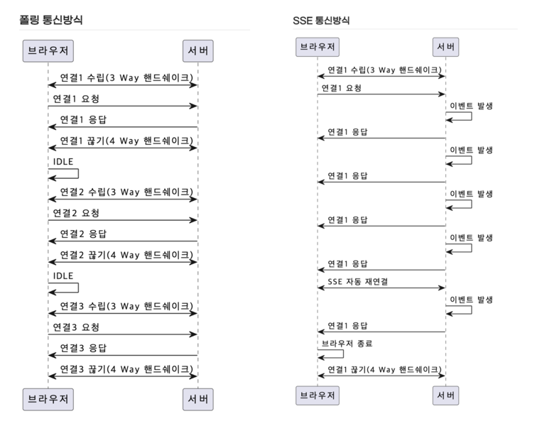

# SSE로 구현하는 체팅 어플

## polling vs SSE
- 실시간인 것처럼 작동하는 방법
- 클라이언트의 요청이 있기 전까지는 서버는 어떠한 데이터도 줄 수 없다.

### 1) 폴링 통신방식
- 클라이언트가 n초 간격으로 request (GET /poll)를 서버로 계속 날려서 Response를 전달받는 방식
- **장점**
    - 비교적 구현이 쉽다. (ajax 통신을 주기적으로 요청하는 것만으로도 구현 가능)
- **단점**
    - 서버측에 보낼 내용이 없어도 클라이언트는 알 수 없기 때문에 계속해서 request를 보내야 한다.
    - HTTP는 단발성 통신이기 때문에 header가 매우 무거운 통신 중 하나로 이 프로토콜이 계속해서 request를 날리면 서버의 부담이 증가한다.
    - 초 간격을 늘리면 실시간성이라고 보기 어렵다.

### 2) SSE (Server-Sent-Events)

- 자바스크립트를 이용하여 서버의 데이터를 실시간, 지속적으로 Streaming하는 기술
- html5 표준, 웹소켓의 역할
- 양방향이 아닌 server → client 단방향
- 재접속의 저수준 처리 자동지원
- SSE 방식이 어떤식으로 폴링 방식의 비효율을 개선하는가?
    - 서버와 한 번 커넥션을 맺어두면 서버에서 이벤트가 발생하면 지속적으로 데이터를 푸시하는 형태로 동작한다.

